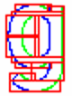

# Vector drawing library

vdraw package implements 2D vector drawing using Vulkan API. 
[Immediate mod UI](vimgui.md) uses only vdraw package to draw all UI controls.

vdraw has two basic elements for 2D drawing: paths and shapes.

## Path

Path is sequence of move, line and quadratic bezier line. 
Lines and bezier lines must make a closed area. Area must be draw in counter clockwise direction.

vdraw library will then fill path and convert it to drawable element using:
- path splitting
- or converting path to glyph

*Path stroking is currently not supported but will support later.*

### Path splitting

As most modern GPU really can't draw vectors, vdraw module must convert path to something that can be drawn.
It could be possible to convert path to triangles that fill paths area. 
However, final result will be quite inaccurate without heavy multisampling.

In stead vdraw convert paths to squares with left and right boundary. For example to draw letter G:

vdraw will split letter to several square area (red lines). 
Inside each square there is left edge (blue line) and right edge (green line). 
GPU will draw whole squares but edge lines are used to limit where we actually draw pixels. 
Near edges we can smooth image using alpha blend. 
If pixel is near edge we can start adjusting pixels alpha values instead just completely drawing or discarding a pixel.
This will smoothen image in X direction.

### Glyphs

Glyphs are alternate way to draw fill path. In glyph vdraw will compute signed distance field for each path.
Signed distance fields are stored in GlyphSet.
Each glyph is encoded into single color bitmap where value of pixes tells how close pixes is from edge. 
Negative values indicates that shape pixel is inside path and positive outside.

In example, red areas are outside, black inside and gray area close to border indicates where we are close inside or outside actual path.

When drawing glyph, vdraw draws one square containing glyph and then uses GlyphSet image to sample if pixel is inside or outside path.
As texture sampling interpolates between adjacent pixel, we will automatically interpolated value of signed depth field at pixel location.

When should I use glyphs and when path splitting?

Glyphs have some limitation:
- Each glyph in one glyphset have same size (it is actually multilayered single color image ). So paths should about same size.
- Glyph need preparations (computing them) and storage (multilayered image). So you need to know in advance what path you need.
- Glyph can't be rotated. (Neither can path splits but as they are cheaper to create new path and rotate those)

So, glyph suits best for static shapes like fonts, icons etc. and path splits for dynamic shapes.
Instead, path split can lose some details in Y direction. So some small horizontal details can be lost
in path splitting.

## Shape

Shape is third supported way to draw 2D filled elements in vdraw. 
Shapes are signed distance functions. They are fastest and most accurate way to draw shapes.
Challenge is that you must be able to make a SDF function that describes what is inside and what outsize.
However, we can quite easily formulate most important shapes need in UI like rounder rectangles using shapes.

Shape functions must therefore be compiled into SPIR-V code before they can be used. 
VGE has embedded glsl to SPIR-V compiler that can be used to compile custom shapes.

See vdraw/shape.go on how to create a shape function

## Fonts

Fonts are actually just path where each rune is key to a path. 

vdraw can load ttf fonts can convert them to paths.
Fonts will cache all drawn path so that we have to calculate path splits only once per each character.

Fonts also supported adding some of the runes in them to GlyphSet. 
When drawing text vdraw will select glyphed version of character if one is available. 
One drawn text can contain both glyphed and non glyphed runes. One GlyphSet can contain runes from multiple fonts.

 

