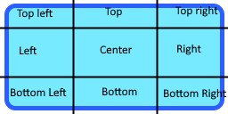

# VGE User interface

VGE supports an UI suitable for games and simulations. It still lacks some features like a clipboard control typically found in business applications.

Nearly all examples set up some kind of UI.

## UIView

UIView is the root control of UI. To show an UI, you must bring UIView to scene.

The actual UI is constructed with UI controls. UI controls in VGE follow the same philosophy used in some modern UI frameworks:
Each individual control is very simple and only performs one task. In the Go language, there is no inheritance which makes building ten levels deep inherited controls quite challenging anyway (and WPF-like deep inheritance is quite confusing in my opinion anyway).

You can combine simple UI controls to build smarter UIs.
For example, there is no margin or padding settings in normal controls. However there is generic Padding control
that can inset its content based on requested padding.

## Layout

VGE controls support a simple measurement system. Each component can calculate optimal size with a given UI width.
Some controls like Stacks use this information to position controls.

If you need a more complex layout the Canvas control supports scaling and anchoring content based on design and actual size.
You can, of course, embed the canvas inside a canvas to get more complex layouts.
If that is not enough, it is most likely quite easy to make a custom container that can handle the required layout calculations.

## Controls

VGE supports basic UI controls including buttons, sliders and text boxes. The UI example project shows the use of most of the controls in VGE.

### Basic controls

#### Label

Control that draws a text.

#### TextBox

User editable single line text area.
Supports a change event when the user changes the text box content.

#### Button and MenuButton

Button control that has content (typically a label but can be anything) and the Click action that will be activated if the user clicks the button.
MenuButton is like a Button but typically has a different representation (Style).

#### Padding

Pads inner content

#### Conditional

Allows hiding the content with a boolean flag. VGE controls are this simple, there is not even a visibility flag on normal controls.
You use a Conditional control to implement that.

#### ToggleButton

A ToggleButton toggles inner content when user clicks the control.
ToggleButton also supports OnChanged event to detect a state change. ToggleButton is typically used to draw radio and check boxes.

#### HSlider and VSlider

Horizontal and vertical sliders that support OnChanged event when the user drags the slider.

#### Panel

A Panel that contains child controls. Typically to group elements of an UIView.

#### Sizer

Allow setting minimum and maximum size for content.

_Some parent controls may disregard a size request and draw the control with a different size_

### Layout controls

Layout controls can have multiple children.

#### HStack and VStack

Layouts children horizontally or vertically. Stack controls use the child size measurement when
arranging child controls. Both stacks support padding between elements.

#### Canvas

A more complex layout control for supporting anchoring and resizing child controls based on design size vs actual size.

Each child has a field that indicates:
 - How much of the canvas position change should be applied to the childrens position.
 - How much of the canvas size change should be applied to the childrens size.

#### ScrollViewer

An "infinite" area that supports scrolling content if the content does not fit into the viewable area.
The ScrollArea only supports a single child that is typically some content control.

## Themes

The VGE Controls themselves do not contain any representation! Instead, you must assign a Theme for each UIView.
The VGE controls will use a given theme to request how they should draw themselves.
This is bit similar to the principles that are used in WPF (Windows Presentation Foundation), although this implementation is much more simpler.

Control provide a Style for control as a theme. The style is then used to measure and draw the control.
Styles typically use GlyphSets to draw the actual UI elements and fonts.

The VGE contains one standard theme (mintheme) that are only used for vector graphics to draw controls.
Mintheme allows some customization like changing the default font.

The UI example project also has a sample custom theme, theme3D. Theme3D is an example on how to build your own theme using single color bitmap glyphs.

## Glyphs and GlyphSets

Glyphs are implemented in vglyph model. The idea is to pack multiple small images into a GlyphSet. The VGE can then draw individual glyphs using the glyph set.

GlyphSets are mainly either shapes for UI controls or fonts. The VGE draws user interfaces by drawing glyphs.

The GlyphSet can have one of following formats:
- Signed depth field. Signed depth fields are built from vectors using a vector builder. The vectors can be lines or quadratic bezier curves. The depth fields have only on / off settings.
A signed depth field allows for a smoother scaling and is optimal for TTF fonts
- Single color + alpha.
- Full color (rgba8)

Glyphs can also have a border, either top/botton, left/right, both or neither.
Fonts typically do not have border areas. Most ui glyphs like a button will have both border areas.

When a glyph is drawn, we will give the glyph location and color. Additionally, we will give the size of borders for glyphs that have a border area.
Resizing a bordered glyph but keeping the border size constant will stretch the image so that borders will keep their thickness.

When drawing a glyph, the colors are handled depending on GlyphSet format
- For a signed depth field, pixels have set (<0.5) for foreground color and unset (0>0.5) for back color.
  The Glyph shader will smoothstep between on/off values to make a shaper more sharp looking,
- For a single color + alpha, color intensity controls the ratio between a fore color (1) and a back color. The alpha channel is multiplied with the alpha color of the images.
- For rgba glyphs, color settings are ignored. Colors are fetched directly from image.

So a full RGBA glyph has the least rendering options but can show colorful glyphs. Signed depth fields scales best but supports only on/off color.
A single color glyph is something in between.

## Fonts

VectorBuilder can directly build a glyph set from a TTF (TrueType) font file.
For an example, see the glTFviewer on how to load a font file into GlyphSet.

