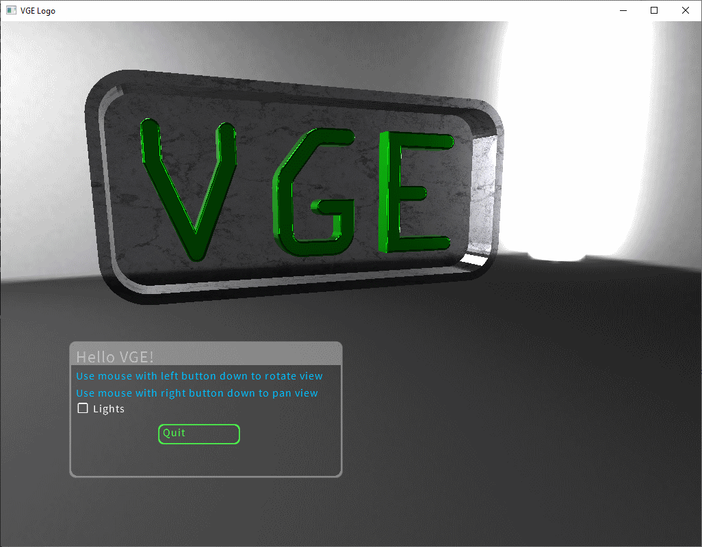

# VGE (Vulkan Graphics Engine)

The VGE is a graphics engine for the Go language that uses the [Vulkan](https://www.khronos.org/vulkan/) API. 


## VGE code example (logo.go)

A simple example showing a simple user interface and a 3D model on screen. 
See full sample with imports in examples/basic/logo.go

```go
func main() {
	// Set loader for assets (images, models). This assumes that the current directory is the same where hello.go is!
	vasset.DefaultLoader = vasset.DirectoryLoader{Directory: "../../assets"}

	// Initialize the application framework. Add validate options to check Vulkan calls and desktop to enable windowing.
	vapp.Init("hello", vapp.Validate{}, vapp.Desktop{})

	// Create a new window. The window will have its own scene that will be rendered using ForwardRenderer.
	rw := vapp.NewRenderWindow("hello", vapp.NewForwardRenderer(true))
	// Build scene
	buildScene(rw)
	// Wait until the application is shut down (event Queue is stopped)
	vapp.WaitForShutdown()
}

func buildScene(rw *vapp.RenderWindow) {
	// Loads envhdr/studio.hdr and creates a background "skybox" from it. The VGE can create a whole 360 background
	// from full 360 / 180 equirectangular image without needing 6 images for a full cube
	// MustLoadAsset will handle loading the actual asset using vasset.DefaultLoader is set at the start of program
	// MustLoadAsset will also handle ownership of asset (it will be disposed with the device)
	eq := vapp.MustLoadAsset("envhdr/studio.hdr",
		func(content []byte) (asset interface{}, err error) {
			return env.NewEquiRectBGNode(vapp.Ctx, vapp.Dev, 100, "hdr", content), nil
		}).(*env.EquiRectBGNode)
	// Add a loaded background to scene
	rw.Env.Children = append(rw.Env.Children, vscene.NewNode(eq))

	// Load the actual model
	model, err := vapp.LoadModel("gltf/logo/Logo.gltf")
	if err != nil {
		log.Fatal("Failed to load gltf/logo/Logo.gltf")
	}

	// Again, registers the model ownership to a window
	rw.AddChild(model)
	// Creates new nodes from the model
	rw.Model.Children = append(rw.Model.Children, vscene.NodeFromModel(model, 0, true))
	// We will also need a probe to reflect the environment to the model. Probes reflect everything outside this node to the children of the node
	// In this case we reflect only the background
	p := env.NewProbe(vapp.Ctx, vapp.Dev)
	rw.AddChild(p) // Remember to dispose probe
	// Assigns a probe to root model
	rw.Model.Ctrl = p

	// Attaches a camera to the window (with a better location than the default one) and an orbital control to camera
	c := vscene.NewPerspectiveCamera(1000)
	c.Position = mgl32.Vec3{1, 2, 10}
	c.Target = mgl32.Vec3{5, 0, 0}
	rw.Camera = c
	// Adds the orbital controls to the camera. If priority > 0, panning and scrolling will work even if the mouse is on UI. UI default show priority is 0
	vapp.OrbitControlFrom(-10, rw, c)

	// Finally create 2 lights before UI
	// Create a custom node control to turn light on / off
	visible := &nodeVisible{}
	nLight := vscene.NewNode(visible)
	rw.Env.Children = append(rw.Env.Children, nLight)
	// First light will not cast a shadow, the second will
	l1 := &vscene.PointLight{Intensity: mgl32.Vec3{1.4, 1.4, 1.4}, Attenuation: mgl32.Vec3{0, 0, 0.3}}
	l2 := shadow.NewPointLight(vscene.PointLight{Intensity: mgl32.Vec3{0, 1.4, 1.4}, Attenuation: mgl32.Vec3{0, 0, 0.2}}, 512)

	// Add a shadow light to the scene on location 1,3,3 and 4,3,3
	nLight.Children = append(nLight.Children,
		vscene.NewNode(&vscene.TransformControl{Transform: mgl32.Translate3D(1, 3, 3)}, vscene.NewNode(l1)),
		vscene.NewNode(&vscene.TransformControl{Transform: mgl32.Translate3D(6, 3, 3)}, vscene.NewNode(l2)))
	// Create the UI. First we must create a theme.
	// There is a builtin minimal theme we can use here. It will use OpenSans font on material icons font if none other given.
	th := mintheme.NewTheme(vapp.Ctx, vapp.Dev, 15, nil, nil, nil)
	// Add a theme to RenderWindow dispose list. In real app we might use the theme multiple times on multiple windows and should handle the disposal of it
	// as a part of the process of disposing the device.
	rw.AddChild(th)
	var bQuit *vui.Button
	ui := vui.NewUIView(th, image.Rect(100, 500, 500, 700), rw).
		SetContent(vui.NewPanel(10, vui.NewVStack(5,
			vui.NewLabel("Hello VGE!").SetClass("h2"),
			vui.NewLabel("Use mouse with left button down to rotate view").SetClass("info"),
			vui.NewLabel("Use mouse with right button down to pan view").SetClass("info"),
			&vui.Extend{MinSize: image.Pt(10, 10)}, // Some spacing
			vui.NewCheckbox("Lights", "").SetOnChanged(func(checked bool) {
				visible.visible = checked
			}).SetClass("dark"),
			&vui.Extend{MinSize: image.Pt(10, 10)}, // Some spacing
			vui.NewButton(120, "Quit").SetClass("warning").AssignTo(&bQuit),
		)).SetClass(""))
	bQuit.OnClick = func() {
		// Terminate the application. We should run it like most UI events on a separate go routine. Otherwise we have a change to deadlock the engine
		go vapp.Terminate()
	}
	// Attaches UI to a scene and shows it. UI panels are by default invisible and must be shown explicitly
	rw.Ui.Children = append(rw.Ui.Children, vscene.NewNode(ui))
	ui.Show()
}

type nodeVisible struct {
	visible bool
}

func (n *nodeVisible) Process(pi *vscene.ProcessInfo) {
	pi.Visible = n.visible
}
```

Running logo.go with `go run logo.go` should produce something like



## Sample videos

Some sample videos recorded from VGE example projects:
- [glTFViewer](https://youtu.be/MAgn8qudW-w) browser for glTF 2.0 samples.
- [Robomaze](https://youtu.be/RQ3mJl3lQ0Y) performance test animation.
- [Animation](https://youtu.be/FTCOo1gcA8I) BVH animation support (Experimental)

You can also install the VGE and run the same examples yourself!

## Installation

First: you need a Go compiler. The VGE has been mostly tested with Go1.13 and Go1.14. 
An older version may work, but I recommend using latest released version.

Install VGE like any go package:
`go get github.com/lakal3/VGE`

Note **Only 64bit (amd64) Windows (only tested on Windows 10) or Linux (experimental) is supported**. You must also have **updated** Vulkan drivers.

### Additional steps on Windows

Some lower level functions are implemented in C++. See [VGE architecture](docs/architecture.md) for more description of why and how VGE is implemented.
 
On Windows, you do not have to install the C/C++ compiler. You can use a prebuilt C++ VGELib.dll. Windows implementation does not use the CGO at all! 
 
Copy prebuilt/win_amd64/VGELib.dll to some directory in your search PATH or update searchpath to include prebuilt directory.
Alternatively you can [build VGELib](docs/build_vgelib.md) VGELib.dll yourself.

If you plan to do any additional projects with Vulkan or the VGE, I also recommend you to install [Vulkan SDK](https://www.lunarg.com/vulkan-sdk/). 
Vulkan SDK also contains the SPIR-V compiler that you will need when developing your own shaders. 
Vulkan SDK also contains Vulkan validation layers that are really helpful in pinpointing possible errors in your API calls. 
The VGE supports a simple way of enabling Vulkan validation layers.

### [Installation on Linux](docs/linux_install.md) (Experimental)
 
## Learn to use VGE

The VGE engine is really tiny compared to most of the graphics frameworks that support Vulkan. 
However, there is still quite a lot of code and browsing the API help document is not very enlightening. 

Perhaps the best approach for learning VGE is to browse through the examples included in the project. 
These examples try to pinpoint most important aspects of VGE and it's features.

- Basic - The most basic sample that you should be able to `go run` if everything is installed ok.
- Cube - A simple cube using the lower level API to draw cube on screen
- Model - Additional samples on how to load models and manipulate a scene.
- WebView - Render images in the background and serve them to the web client 
(*The demo will show that Vulkan can do multithreaded rendering, and you can easily use Vulkan to render images in the background*)
- glTFViewer - A tool to browse some of the glTF sample images.  
- Robomaze - A performance test tool / example that supports some advanced features like decals.
- Animate (Experimental) - Support for reading animations from the BVH (Biovision Hierarchy) files and apply them on rigged models.

The VGE documentation does not go into the details of the Vulkan API. 
To lean the core Vulkan features, below I have listed some nice web articles about it. 
- [https://gpuopen.com/understanding-vulkan-objects/] - Good overview of Vulkan object model
- [https://vulkan-tutorial.com/] - (Be prepared to write >600 LoC C/C++ to draw a triangle on screen)
- [https://software.intel.com/en-us/articles/api-without-secrets-introduction-to-vulkan-part-1]

## Features of the VGE

This is a short list of the features (existing). [Roadmap](docs/roadmap.md) has a list of planned features.

- Handling VGE [core objects](docs/vk.md)
- [Image](docs/vimage.md) loading and handling
- [Model](docs/vmodel.md) building and loading. VGE currently supports OBJ and glTF 2.0 formats.
- Basic materials: Unlit, Phong and PBR [Model](docs/vmodel.md)
- Lights: Point and directional, including shadows for point lights 
- Scene building and animation [Scene](docs/vscene.md)
- Glyph rendering including support for TTF fonts. Mainly used to support [VGE UI](docs/vui.md).
- Background environment using (HDR) equirectangular images [Scene](docs/vscene.md)
- An environmental probe to support reflections of PBR materials. 
Probe will also generate spherical harmonics to approximate ambient lightning.  [Scene](docs/vscene.md)
- Easily extendable game UI support [VGE UI](docs/vui.md).
- UI theming [VGE UI](docs/vui.md).
- Event queue to handle system level events [VGE App](docs/vapp.md)
- Window, mouse, keyboard etc management  (Uses GLFW C library for multi platform support)
- High level, easier to use setup for basic applications [VGE App](docs/vapp.md)
- Multi threaded [Architecture](docs/architecture.md)
- Rendering without UI (for example to quickly render images in a web server!)
- Calculating algorithms in GPU. VGE supports Vulkan compute shaders. (See for example vglyph/vdepth shader)
- (Experimental) Decal support [Scene](docs/vscene.md)
- (Experimental) Apply BVH animations to existing rigged models


## Status

VGE started when I wanted to learn Vulkan programming. 
I gradually added new features to handle different aspects of Graphics programming.

Now VGE has all the basic elements to make Vulkan based 3D programs using Go. 
The examples give a quite nice overview of the existing features in VGE.

Features not marked as preview or experimental should be considered fairly stable and breaking API changes will happen only if really necessary.

**Note that the number of different devices VGE has been tested on is limited and 
Vulkan drivers have bugs and inconsistencies. Please report any device incompatibilities you find.**

[Roadmap](docs/roadmap.md) lists more planned features. [Changes](changes.md) will contain all important changes between versions.

## [MIT License](license.md)

## [Credits](docs/credits.md) 

